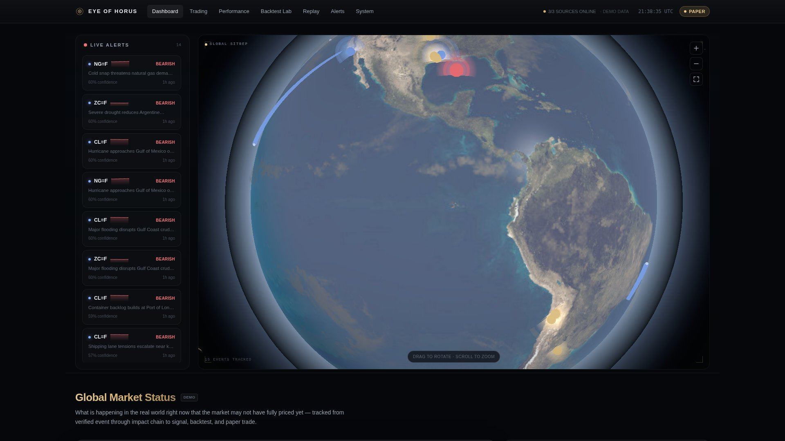
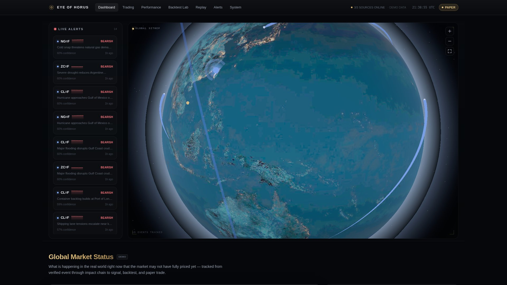
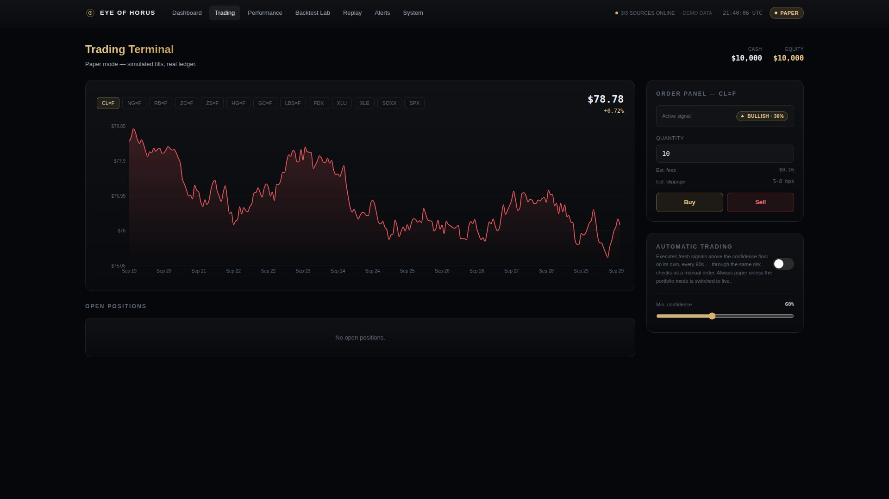
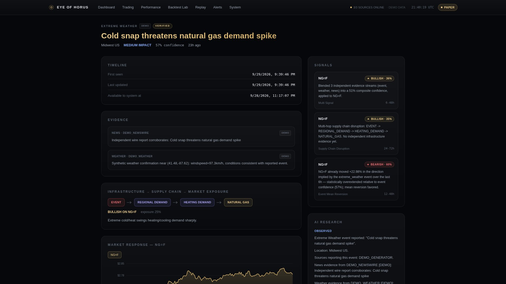
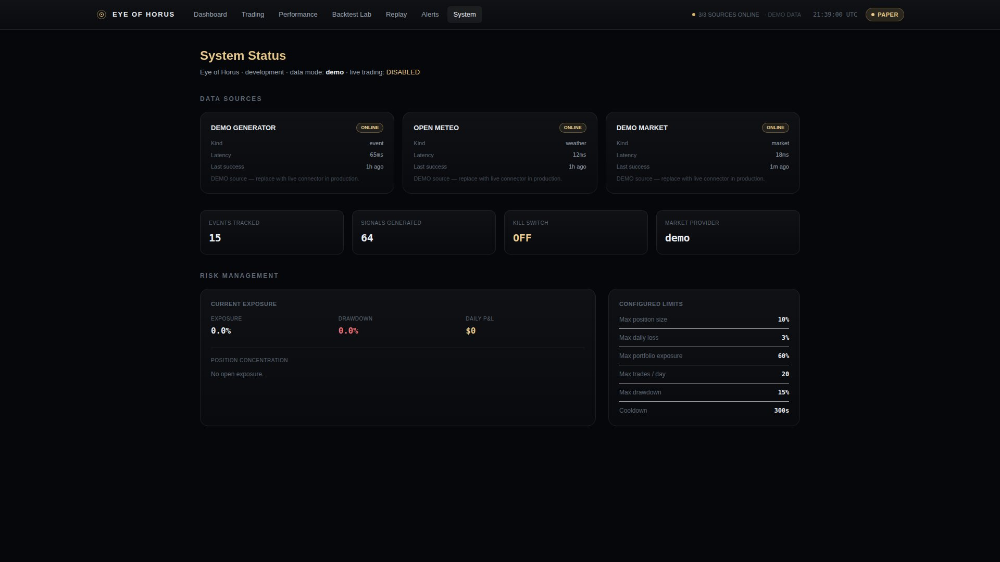

<div align="center">

# 👁 Eye of Horus

**Event-to-Market Intelligence & Autonomous Trading Platform**

Tracks the causal chain from real-world events to market impact — end to end,
with an enforced no-look-ahead-bias guarantee at every step.

```
EVENT → VERIFICATION → IMPACT GRAPH → SIGNAL → BACKTEST → PAPER TRADE → OUTCOME
```

</div>

<br>

<p align="center">
  
</p>

The core research question this platform is built to test empirically, not assume:
**did the system detect real-world information early enough and reliably enough to
provide measurable informational value?**

## What it does

- **Watches for events** — extreme weather, infrastructure disruption, supply-chain
  shocks — verifies them against multiple independent evidence sources, and geolocates
  them on a live 3D globe.
- **Traces market exposure** — a rule-based impact graph walks event →
  infrastructure → supply chain → commodity/asset, scoring exposure at every hop.
- **Generates trading signals** from that exposure through five independent
  strategies (including a naive baseline every other strategy has to beat), each
  producing a confidence score and a plain-English rationale.
- **Backtests every signal** through an event-driven backtester with an *enforced,
  adversarially-tested* temporal-integrity guard — nothing in a backtest can ever see
  data from after the simulated moment.
- **Trades on it** — manually from the Trading Terminal, or fully automatically via an
  opt-in scheduler loop that executes fresh signals above a confidence floor through
  the same risk checks a human order goes through. Paper by default; a `LiveBroker`
  interface exists but is deliberately stubbed until real broker credentials are
  wired in on purpose.
- **Explains itself** — every signal and event carries an AI-research breakdown
  (OBSERVED / DERIVED / HYPOTHESIS / UNCERTAIN), falling back to a deterministic
  synthesizer when no Claude API key is configured, so nothing is ever fabricated.

## Screenshots

<table>
<tr>
<td width="50%"></td>
<td width="50%"></td>
</tr>
<tr>
<td width="50%"></td>
<td width="50%"></td>
</tr>
</table>

The globe is a genuine 3D Earth (React Three Fiber, custom day/night shader, cloud
layer, ocean specular, cinematic bloom) — not a flat map projection. It's fully
interactive (drag to rotate, scroll to zoom, fullscreen expand), shows live-animated
flight and vessel traffic with glowing trails, and every panel around it is real data,
never mocked: event counts, alert feed, risk exposure, and position sizing all come
straight from the API responses you'd get from `curl`ing the backend yourself.

## Architecture

Three layers, two apps:

- **`backend/`** (FastAPI + SQLAlchemy 2.0 + Pydantic v2) — Event Engine (ingestion +
  multi-source verification), Impact Engine (event → infrastructure → supply chain →
  commodity graph), Market Engine (demo generator or yfinance), Signal Engine (5
  strategies), Quant Engine (backtester with the temporal-integrity guard), Trading
  Engine (`RiskEngine` → `BrokerAdapter` → `PaperBroker`, plus the automatic-trading
  scheduler loop), and an AI Research layer.
- **`frontend/`** (Next.js 16 + React 19 + TypeScript + Tailwind + React Three Fiber) —
  the Situation Room dashboard, 3D globe, Trading Terminal, Backtest Lab, Research
  Replay, Alert Center, and System Status.

See `backend/app/` and `frontend/app/` for the full module layout; most modules carry
a short comment explaining *why*, not just what.

## Data mode: demo vs. live

`DATA_MODE=demo` (the default, and the only mode that needs zero setup) uses
deterministic, seeded generators for events and market prices — every row is flagged
`is_demo: true` end-to-end into the API and UI, with a visible **DEMO** badge wherever
that data is shown. The real connectors are fully implemented
(`app/services/event_engine/connectors/nasa_eonet.py`, `open_meteo.py`,
`app/services/market_engine/yfinance_adapter.py`) — switching to `DATA_MODE=live` and
`MARKET_DATA_PROVIDER=yfinance` is a config change, not a rewrite, once the deployment
environment has outbound network access to those APIs.

The demo market-data generator layers a small, deterministic post-event price drift on
top of a random walk, specifically so the Backtest Lab has something non-trivial to
find with zero live data. That drift is a demonstration of the event→price mechanism
the platform is built to detect — **not** a claim of real predictive edge. In live
mode, prices come from Yahoo Finance with no synthetic signal baked in.

## Quickstart

**Docker Compose** (fastest — no local Python/Node needed):

```bash
docker compose up --build
```

Frontend at http://localhost:3000, backend at http://localhost:8000/api/health. No
`.env` file required — the compose services already run in demo mode.

**Or locally, no Docker:**

```bash
# Backend
cd backend
python3 -m venv .venv && source .venv/bin/activate
pip install -r requirements.txt
cp .env.example .env   # defaults are fine for demo mode
uvicorn app.main:app --reload --port 8000
```

On first startup it seeds demo events, computes impact chains, seeds demo price
history, generates signals, and creates a default paper portfolio with $10,000 — all
idempotent, safe to restart.

```bash
# Frontend, in a second terminal
cd frontend
npm install
cp .env.example .env.local   # NEXT_PUBLIC_API_BASE=http://localhost:8000
npm run dev
```

Open http://localhost:3000.

## Deploy your own

Both halves deploy free, with no credit card:

**Backend → [Render](https://render.com)** (Blueprint deploy):
1. Fork/push this repo to your own GitHub.
2. Sign up at render.com with GitHub (free, no card).
3. Dashboard → **New** → **Blueprint** → select the repo → **Apply**.

`render.yaml` at the repo root describes everything — build command, start command,
health check, and every env var already set to a demo-safe default. Nothing to fill
in unless you want the optional `ANTHROPIC_API_KEY` for real AI research synthesis.
The free plan spins down after ~15 min idle (cold start on the next request) and has
an ephemeral filesystem — harmless here since the app reseeds its own demo data on
every startup.

**Frontend → GitHub Pages** (already automated):

`.github/workflows/gh-pages.yml` builds and deploys the static frontend on every push
to `main` that touches `frontend/**`, or manually via the Actions tab. Set the
`NEXT_PUBLIC_API_BASE` repository variable (Settings → Secrets and variables →
Actions → Variables) to your deployed Render backend's URL so the static site talks to
real data instead of `localhost`.

## Environment variables

Every setting has a working, demo-safe default — **nothing is required** to run this
in demo mode. Full reference in `backend/.env.example` and `frontend/.env.example`;
highlights:

| Variable | Default | Required? |
|---|---|---|
| `DATA_MODE` | `demo` | No — `live` enables real NASA/Open-Meteo connectors |
| `MARKET_DATA_PROVIDER` | `demo` | No — `yfinance` enables real market data |
| `LIVE_TRADING_ENABLED` | `false` | No — paper trading needs nothing else |
| `ANTHROPIC_API_KEY` | unset | No — falls back to a deterministic evidence synthesizer |
| `DATABASE_URL` | bundled SQLite | No — set for Postgres in production |
| `NEXT_PUBLIC_API_BASE` (frontend) | `http://localhost:8000` | No — only matters once frontend and backend are hosted separately |

## Tests

```bash
cd backend
source .venv/bin/activate
pytest tests/ -v
```

53 tests covering every engine, including a **verified, adversarial**
look-ahead-bias test: it deliberately persists a price bar whose `availability_time`
is after the event that would use it, and asserts the backtester's `TemporalGuard`
catches it and sets `look_ahead_bias_detected: true` rather than silently trading on
it.

## Validation checklist

| Capability | Status |
|---|---|
| Detect events | ✅ NASA EONET connector + demo generator |
| Verify events | ✅ multi-source/multi-evidence confidence scoring |
| Geolocate events | ✅ lat/lon + GeoJSON, rendered on an interactive 3D globe |
| Connect infrastructure | ✅ rule-based impact graph (event→infra→supply chain→commodity) |
| Determine market exposure | ✅ exposure scoring on every impact link |
| Generate a signal | ✅ 5 strategies incl. baseline |
| Backtest the signal | ✅ event-driven backtester, per-strategy metrics |
| Prevent look-ahead bias | ✅ `TemporalGuard`, adversarially tested |
| Simulate a trade | ✅ `PaperBroker` with spread/fees/slippage |
| Trade automatically | ✅ opt-in scheduler loop through the same risk checks as a manual order |
| Calculate P&L / drawdown | ✅ portfolio + backtest metrics, live Risk Management panel |
| Explain a signal | ✅ AI Research layer, OBSERVED/DERIVED/HYPOTHESIS/UNCERTAIN |
| Replay history | ✅ Research Replay, point-in-time reconstruction |
| Track outcomes | ✅ trade ledger + performance page |
| Survive a failed data source | ✅ per-source status tracking, degrades independently |
| Run locally | ✅ Docker Compose or manual |
| Deploy for free | ✅ Render Blueprint (backend) + GitHub Pages (frontend) |

## Scope

**Built**: everything in the validation checklist above, plus live flight/vessel
traffic visualization, a fullscreen-capable 3D globe with cloud layer and bloom, and
a real-time SSE stream endpoint (`/api/stream/live`).

**Deferred, interfaces in place but not implemented**: real live AIS/flight feeds
(the globe's traffic layer is animated demo data), satellite imagery, a persisted
supply-chain graph database, advanced ML models, and a real live broker integration —
no broker credentials exist anywhere in this repo, and `LiveBroker` refuses to place
orders (see `LIVE_TRADING_ENABLED`) until one is wired in deliberately.
